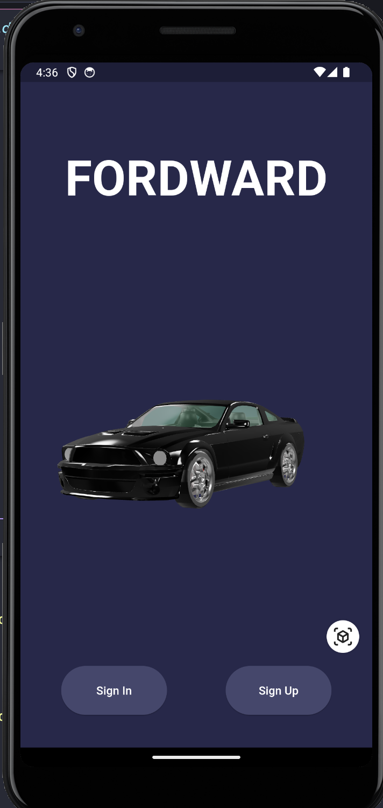
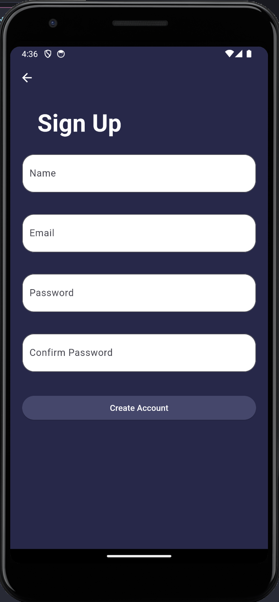
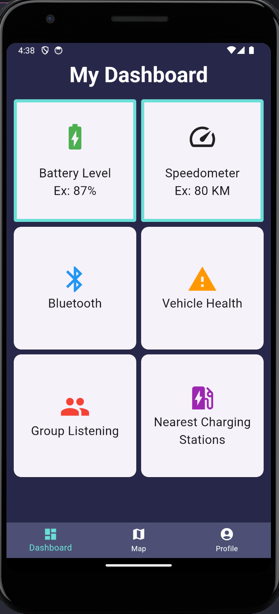
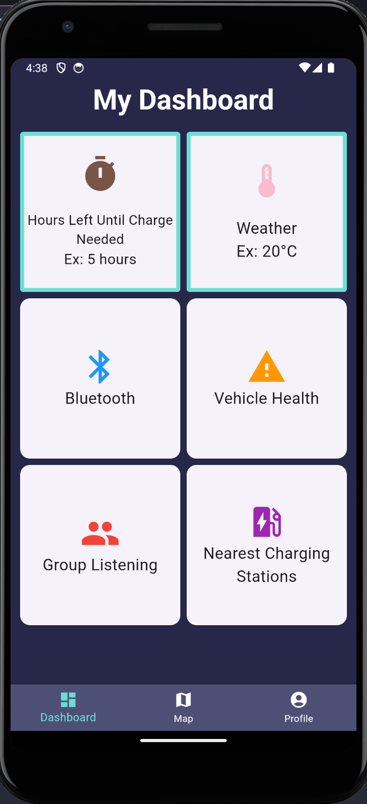
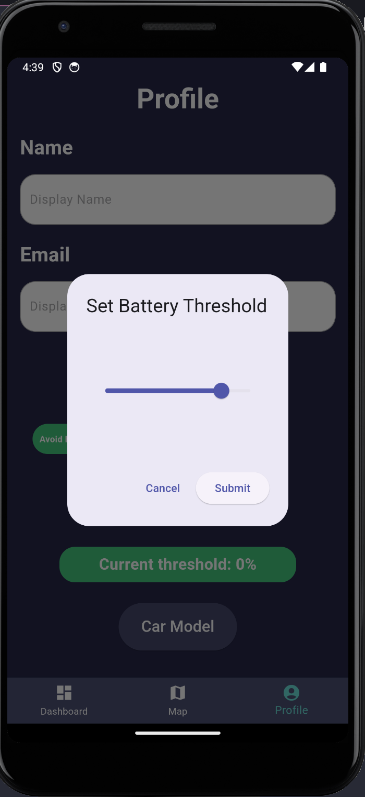
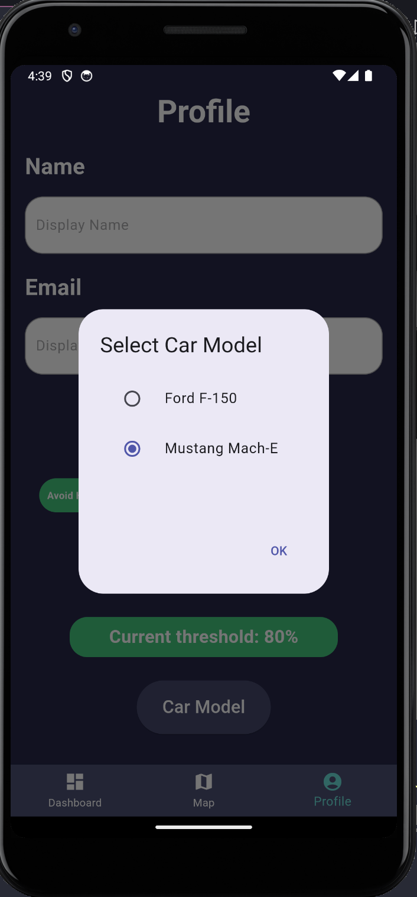
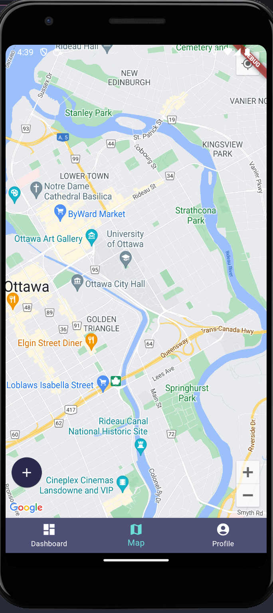
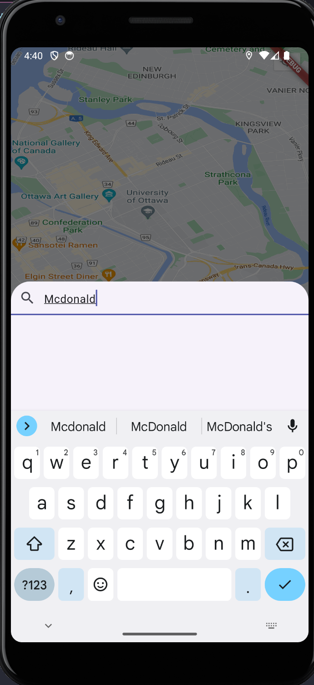

# Fordward

<strong>Fordward</strong> is a mobile application to help track and plan out EVs based on vehicle models designed by <strong>Ford</strong>. While taking a drive, this app allows you to locate nearby charging stations, monitor battery life, enjoy group listening with friends and much more!

Take a leap forward with <strong>Fordward!</strong>

## Prerequisites

- Ensure Flutter is installed on your machine
- Flutter SDK
- Dart SDK
- Visual Studio Code or Andorid Studio

## Installation

Clone the repository to your local machine:

```sh
git clone https://github.com/KYLEKHAI/fordward.git
```

Navigate to the project directory:

```sh
cd forward
```

Fetch all the dependencies:

```sh
flutter pub get
```

Run the application:

- In-Browser mode
- Using a Virtual Machine/Emulator

## Features

- **Account Management**: Maintain all your settings using our secure account management all within our app. Sign up for an account and sign in to access the app with a simple email and password combination.

- **Dashboard**: The main screen which consist of a driver-friendly interface to applications and to monitor your environment.

- **Settings**: Select options to avoid when navigating through the map. Set the battery threshold to efficiently save energy at a specific level. Cater the app towards your specific vehicle when choosing the model of various Ford vehicles.

- **Real-time Map**: Integration with Google Maps allows for easy access in finding nearby charging stations with detailed information, including availability, charging speed, and compatibility with your EV model.

<table>
    <tr>
    <td></td>
    <td></td>
    </tr>
    <tr>
      <td></td>
      <td></td>
    </tr>
    <tr>
      <td></td>
      <td></td>
    <td></td>
    </tr>
  <tr>
   <td></td>
    <td></td></tr>
  </table>

## How it is built

- Flutter Framework
- Flutter Plugins (Geolocator, Model Viewer Plus)
- Dart
- HTML
- C++
- Google Play Services
- Firebase

## Acknowledgments

<em>This project is hosted by the hackathon <strong>uOttaHack6!</strong></em>

<div align="center">
    
</div>
