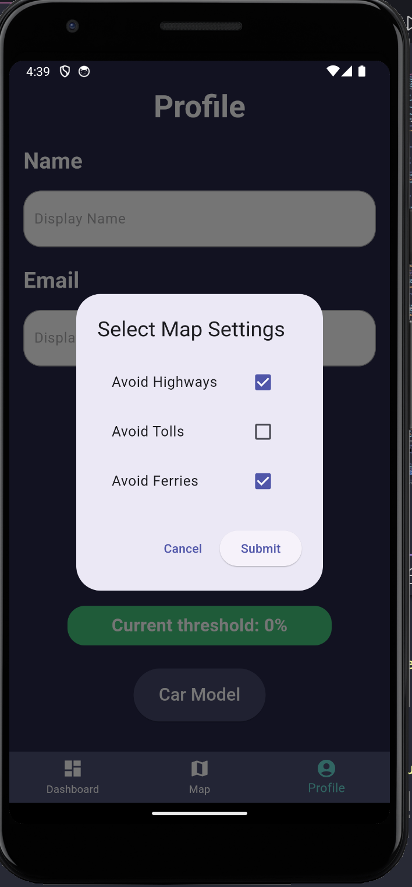

# Fordward

Welcome to Forward App, a modern Flutter application designed to provide a seamless and intuitive user experience. This project leverages the powerful capabilities of Flutter to deliver a cross-platform application that runs smoothly on both Android and iOS devices.

## Getting Started

To get started with Forward App, ensure you have Flutter installed on your machine. For detailed instructions, refer to the [Flutter installation guide](https://docs.flutter.dev/get-started/install).

### Prerequisites

- Flutter SDK
- Dart SDK
- Android Studio or Visual Studio Code
- An IDE or editor that supports Flutter development

### Installation

Clone the repository to your local machine:

```sh
git clone https://github.com/KYLEKHAI/fordward.git
```

Navigate to the project directory:

```sh
cd forward_app
```

Fetch all the dependencies:

```sh
flutter pub get
```

Run the application:

```sh
flutter run
```

## Features

Describe the key features of your app.
Highlight any unique functionalities.

<table>
  <tr> 
  <td></td>
  <td></td> 
  </tr>

  <tr>
    <td></td>
    <td></td>
  </tr>

  <tr>
    <td></td>
    <td></td>
  <td></td>
  </tr>
<tr>
 <td></td>
  <td></td></tr>
</table>

## Project Structure

The project follows a standard Flutter project structure:

lib/: Contains the Dart code of the application.
android/ and ios/: Contains platform-specific code.
test/: Contains the unit and widget tests.
windows/, macos/, linux/, web/: Contains code to run your application on desktop and web platforms.
Contributing
We welcome contributions to Forward App! If you have suggestions or want to contribute code, please feel free to open an issue or submit a pull request.

## Acknowledgments

Mention any third-party libraries or resources you used.
Acknowledge any contributors or sources of inspiration.
Thank you for checking out Forward App. We hope you find it useful and look forward to seeing what you build with it!
